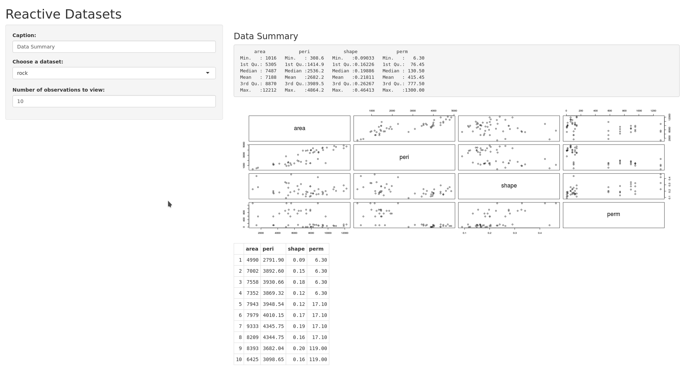

Shiny Application and Reproducible Pitch: Reactive Summary
========================================================
author: Kolesnikov Sergey
date: 19.05.16
autosize: true

Course Project
========================================================

- This is the final presentation for the Course Project of the “Developing data products” course
- This course is part of the “Data Science specialization”
- The project consists in two activities:
  - Create a Shiny application
  - Create a presentation in Slidify or Rstudio Presenter to pitch for the application.

Reactive Summary: Datasets
========================================================

- For this assignment, we used the cars, rock and pressure datasets from datasets package.

- Some sample information about the cars's summary:


```r
summary(cars)
```

```
     speed           dist       
 Min.   : 4.0   Min.   :  2.00  
 1st Qu.:12.0   1st Qu.: 26.00  
 Median :15.0   Median : 36.00  
 Mean   :15.4   Mean   : 42.98  
 3rd Qu.:19.0   3rd Qu.: 56.00  
 Max.   :25.0   Max.   :120.00  
```

Reactive Summary: Functionality
========================================================

When the application is launched, summary, scatter plot and head observations is shown for rock dataset.

The default number of observations used is set to 10, and the default dataset is set to rock.

Use the sliders on the left pane to modify the number of observations and dataset of interest.

The summary, plot and table would be automatically updated.

Reactive Summary: Application
========================================================

- The application can be found in https://scitator.shinyapps.io/CourseProject-ReactiveSummary/
- We can see the summary for rock dataset:


